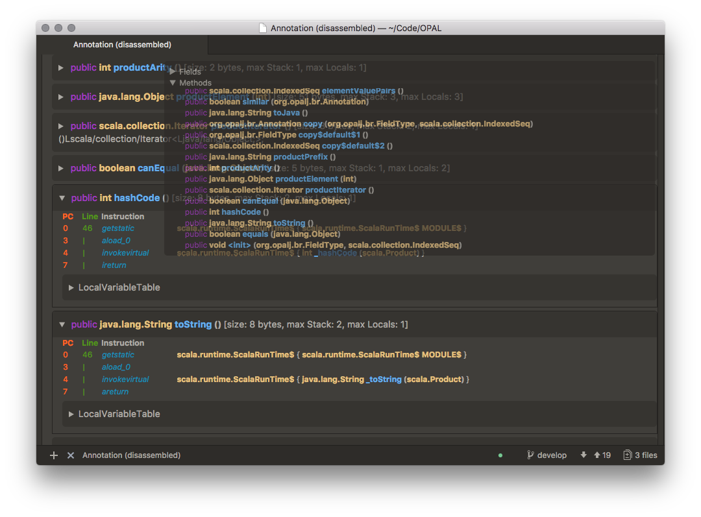
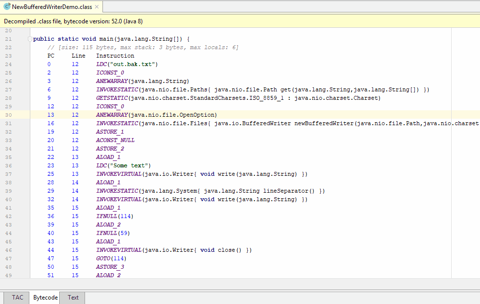

# Facilitating the Development of Static Analyses
OPAL comes with a large number of tools to analyze and visualize various aspects related to *Java Bytecode* projects. These tools can be used as is or can be embedded into other tools. Some of the tools require Graphviz to visualize graphs which depict control- and data-flow information.

## Running Tools which are part of the OPAL Suite
To use the tools, start `sbt`, change to the `project OPAL-DeveloperTools` project and call `run`. Afterwards, you'll see the list of tools which can be run.

## Java Bytecode Disassembler / Java Class File Finder
OPAL has a built-in Java Bytecode Disassembler which is also made available as a [standalone tool](/artifacts/OPALDisassembler.jar) and also as plugins for the [ATOM](https://atom.io/) text editor and the [IntelliJ IDEA](https://www.jetbrains.com/idea/) and [VisualStudioCode](https://code.visualstudio.com/) IDEs.

In contrast to most existing Java disassemblers, OPAL generates an HTML document to provide better syntax highlighting and advanced interaction.

*To use the OPAL Java Bytecode Disassembler Java 8 is required.*

### Command Line Tool

<pre>
Usage: java org.opalj.da.Disassembler
       [-help <tt>will print the help and terminate</tt>]
       [-o &lt;File&gt; <tt>the name of the file to which the generated html page should be written</tt>]
       [-open <tt>the generated html page will be opened in a browser</tt>]
       [-source &lt;File&gt; <tt>a class or jar file or a directory containing jar or class files;
                     if no source files/folders are specified the current folder will be
                     searched for class files</tt>]* (<tt><b>can be specified multiple times</b></tt>)
       [-sourceJDK <tt>the current JDK/JRE is added as a source folder</tt>]
       [-noDefaultCSS <tt>the generated html page will have no CSS styling</tt>]
       [-noMethodsFilter <tt>the generated html page will have no embedded means to filter methods
                       (as a whole, the file will not contain any JavaScript code)</tt>]
       [-noHeader <tt>the generated output will have no header;
                 the top level element will be &lt;div class="class_file"&gt;...&lt;/div&gt;
                 (automatically activates "-noMethodsFilter" and "-noDefaultCSS")</tt>]
       [-css &lt;Source&gt; <tt>the path (URL) of a CSS file (".csss")
                     which will be referenced from the generated HTML page</tt>]
       [-js &lt;Source&gt; <tt>the path (URL) of a JavaScript file (".js")
                    which will be referenced from the generated HTML page</tt>]
       [-showProgress <tt>shows the progress when searching for the class file</tt>]
       [&lt;ClassName&gt; <tt>name of the class for which we want to create the HTML page; if not
                   specified the first class that is found on the given path is taken; this
                   is particularly useful if the source identifies a particular ".class" file</tt>]
</pre>

Note, that the OPAL Disassembler is fast and can scan thousands of class files per second; this makes it also possible to use it to locate a certain class file. For example, if you want to find the jar which defines a specific class, e.g., `java.util.HashMap$Entry`, it is sufficient to specify the root folder of the JDK and let it automatically find the class for you. The generated HTML file will contain precise information where the class file was found. This also works if you specify the root of your `.ivy` or `.m2` folders.

### Integrated
The bytecode Disassembler can be run programmatically as shown next:

```scala
val classFile : org.opalj.da.ClassFile = ...;
val html = classFile.toXHTML()
// println(html)
// org.opalj.io.writeAndOpen(classFile.toXHTML().toString, "ClassFile", ".html")
```

## IDE Plugins

### ATOM
Using the [Java Bytecode Disassembler](https://atom.io/packages/java-bytecode-disassembler) plugin, it is in particular possible to click on a type in a disassembled file to also disassemble the target type. This enables you to quickly navigate between ".class" files.

Screenshot of the OPAL Java Bytecode Disassembler in action:


### IntelliJ Idea
The [Bytecode Disassembler](https://plugins.jetbrains.com/plugin/11566-bytecode-disassembler) plugin provides you with both Bytecode and Three-Address-Code views for both source and ".class files". It also includes structural views to enable you to quickly navigate these views.

The Bytecode Disassembler plugin in action:


### Visual Studio Code
The [Java Bytecode Workbench](https://marketplace.visualstudio.com/items?itemName=STG.java-bytecode-workbench) allows you to view Bytecode or Three-Address Code of your classes directly in Visual Studio Code.

## Invokedynamic Rectifier / Project Serializer

If you are a developer of static analyses and suffered from the pain of having to support Invokedynamic (Java 7+) - in other words, Java lambda expressions and method references - then this is the tool for you! OPAL's project serializer rewrites Invokedynamic calls using plain-old standard Java bytecode instructions to facilitate the writing of static analyses! ___You no longer have to worry about Invokedynamics created by Java compilers.___

Currently, we can rewrite Invokedynamics created by standard Java compilers and we are adding support to completely support Scala. Basically, OPAL replaces the Invokedynamic calls using Java's LambdaMetaFactory by a standard Invokestatic call which will create an instance of a newly created class (similar to what LambdaMetaFactory does). The object will encapsulate the relevant state used by the Lambda and implement the Lambda's functional interface. Later on, when the Lambda is evaluated the generated class will forward the call to the implementation method of the Lambda. The tool is currently in a beta version, but we already successfully rewrote JUnit 5 and were able to execute its entire test suite afterwards (originally over 3000 Invokedynamics).

OPAL's project serializer can be downloaded [here](/artifacts/OPALInvokedynamicRectifier.jar).

If you want to see it in action, just use OPAL's Invokedynamic rectifier to rewrite your project and study the code afterwards using our Bytecode Disassembler (see below).