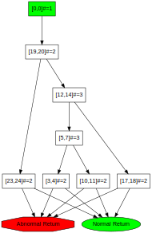

# Engineering Java Bytecode Using OPAL
OPAL is a versatile bytecode engineering framework that offers you mulitple mechanisms to create `.class` files.

## Creating Class Files using OPAL's eDSL

<small>*The following examples can be executed using the Scala console. Start `sbt` in OPAL's main folder, change to the project `project OPAL-DeveloperTools` and start the `console`.*</small>

### Overview

The bytecode assembler framework provides a lightweight eDSL to engineer Java class files. It still requires some understanding of Java bytecode (e.g., the name of the constructor is always `<init>`), but makes the writing of a method's implementation much more trivial since it is no longer necessary to explicitly think about the precise program counters and the precise layout of the code array. Instead of program counters, labels (Scala `Symbol`s) are used to mark jump targets. Additionally, the code can be annotated and that information is automatically extracted and can later be used.

The following is a first example, where we create a class called `Test` which defines a default constructor.

    import org.opalj.ba._; import org.opalj.br._ ; import org.opalj.br.instructions._;
    val cb = CLASS(
        accessModifiers = PUBLIC SUPER,
        thisType = "Test",
        methods = METHODS(
            METHOD(PUBLIC, "<init>", "()V", CODE(
                // The following instruction is annotated with some meta information
                // which can later be used; e.g., to check that some static analysis
                // produced an expected result when this instruction is reached.
                ALOAD_0 -> "MarkerAnnotation1",
                INVOKESPECIAL("java/lang/Object", false, "<init>", "()V"),
                RETURN -> "MarkerAnnotation2"
            ))
        )
    )

`cb` is a (reusable) builder for a class file. To actually create the ".class" file, the `da.ClassFile` object has to be built and then serialized.

    val (daClassFile,codeAnnotations) = cb.toDA()
    val rawClassFile : Array[Byte] = org.opalj.bc.Assembler(daClassFile)

The `rawClassFile` can then be written to the disk using, e.g., `java.nio.file.Files.write(<PATH>,rawClassFile)` or (e.g., for testing purposes) can be passed to an in memory class loader (`org.opalj.util.InMemoryClassLoader`) and immediately be instantiated and executed. The `codeAnnotations` can then be further processed arbitrarily.

> If your class file doesn't define a default constructor, the DSL will automatically add it when required. I.e., the default constructor is created, when you define a regular class - not an interface –, the supertype is specified and no other constructor exists.

### Creating a Marker interface

Creating a marker interface is trivial as shown next:

    val cb = CLASS[Nothing](accessModifiers = ABSTRACT INTERFACE, thisType = "MarkerInterface1")

> Do not forget that an interface always has to be `ABSTRACT` and - if we don't define methods - the returned code annotations have to be explicitly specified as `Nothing`.

### Adding Fields

Fields are simply created using `FIELD` as shown next. The type of a field is defined using a [field descriptor](https://docs.oracle.com/javase/specs/jvms/se8/html/jvms-4.html#jvms-4.3.2).

    val cb = CLASS[Nothing](
        accessModifiers = SUPER PUBLIC, thisType = "org/example/FieldClass",
        fields = FIELDS(
            FIELD(FINAL PUBLIC, "publicField", "I"),
            FIELD(PRIVATE, "privateField", "Z")
        )
    )

### Creating Control Flow

Jump targets are specified using labels directly before the instruction which is the jump target. These labels are then used in branch instructions to identify the branch target.

    val cb = CLASS(
        accessModifiers = PUBLIC SUPER,   thisType = "TestJump",
        methods = METHODS(
            METHOD(PUBLIC, "returnInt", "(I)I", CODE(
                GOTO('IsZero_?),
                'Else,
                ILOAD_1,
                IRETURN,
                'IsTwo_?,
                ILOAD_1,
                ICONST_2,
                IF_ICMPNE('Else),
                ICONST_2,
                IRETURN,
                'IsOne_?,
                ILOAD_1,
                ICONST_1,
                IF_ICMPNE('IsTwo_?),
                ICONST_1,
                IRETURN,
                'IsZero_?,
                ILOAD_1,
                IFNE('IsOne_?),
                ICONST_0,
                IRETURN
            ))
        )
    )

> Making the control-flow graph explicit is possible using the CFGFactory to create the CFG and to then to transform it to an SVG.
>
>     val (br,_) = cb.toBR
>     val cfg = org.opalj.br.cfg.CFGFactory(br.methods.tail.head.body.get)
>     val svg = org.opalj.graphs.dotToSVG(cfg.toDot)
>     org.opalj.io.writeAndOpen(svg,"CFG",".svg")
>
> 

### Exception Handling

To specify exception handlers use `TRY`, `TRYEND` and `CATCH` in combination with labels.

    val (attributeMethodClass, _) = CLASS(
        accessModifiers = PUBLIC, thisType = "MethodWithExceptionHandling",
        methods = METHODS(
            METHOD(
                PUBLIC, "tryCatchFinallyTest", "(I)I", CODE(
                    ICONST_1,
                    ISTORE_2,
                    TRY('Try1),
                    TRY('FinallyTry2),
                    TRY('LastPCTry3),
                    ILOAD_1,
                    IFGE('tryEnd),
                    NEW("java/lang/Exception"),
                    DUP,
                    INVOKESPECIAL("java/lang/Exception", false, "<init>", "()V"),
                    ATHROW,
                    'tryEnd,
                    TRYEND('Try1),
                    GOTO('finally),
                    CATCH('Try1, 0, "java/lang/Exception"),
                    POP,
                    ICONST_0,
                    ISTORE_2,
                    TRYEND('FinallyTry2),
                    GOTO('finally),
                    CATCH('FinallyTry2, 1),
                    CATCH('LastPCTry3, 2),
                    POP,
                    'finally,
                    ILOAD_1,
                    IFLE('return),
                    ICONST_2,
                    ISTORE_2,
                    'return,
                    ILOAD_2,
                    IRETURN,
                    TRYEND('LastPCTry3)
                )
            )
        )
    ).toDA()

### Adding Line Numbers

The eDSL provides explicit support for adding line numbers in line.  Just add a `LINENUMBER` before the instruction which should be associated with the line number.

    val (attributeMethodClass, _) =  CLASS(
        accessModifiers = PUBLIC, thisType = "MethodWithLineNumbers",
        methods = METHODS( METHOD(
            PUBLIC, "<init>", "()V", CODE(
                LINENUMBER(0),
                ALOAD_0,
                LINENUMBER(1),
                INVOKESPECIAL("java/lang/Object", false, "<init>", "()V"),
                'return,
                LINENUMBER(2),
                RETURN
            )
        ))
    ).toDA()

### Adding Further attributes

The DSL interacts seamlessly with the bytecode representation and all attibutes can always be added to the attributes as expected. For example, the following class file is marked as being `Synthetic` and the origin is set using `SourceFile("...")`. The method is marked as being `Deprecated` and as throwing the exceptions `java.lang.Exception`. In the last case, we use the DSL's `EXCEPTIONS` table builder. It enables us to just specify the names of the exceptions. Alternatively, it would have been possible to directly create the underlying `br.ExceptionsTable` using `ObjectType`s.

    val cb = CLASS(
        accessModifiers = PUBLIC SUPER,
        thisType = "SimpleMethodClass",
        methods = METHODS(
            METHOD(
                FINAL.SYNTHETIC.PUBLIC, "testMethod", "(Ljava/lang/String;)Ljava/lang/String;",
                CODE(ACONST_NULL, ARETURN),
                ArraySeq(EXCEPTIONS("java/lang/Exception"), Deprecated)
            )
        ),
        attributes = ArraySeq(SourceFile("ClassFileBuilderTest.scala"), Synthetic)
    )

## Creating Class Files Using OPAL's Default Representation

Instead of creating a `ClassFile` using the eDSL it is also possible to directly create the bytecode using the default representation. Every `br.ClassFile` can be converted to a `daClassFile` using `org.opalj.ba.toDA(<br.ClassFile>)` and can then be serialized as shown above.

## Creating Class Files Using the Bare Bones Representation

### Basics

This representation gives you full control over every single bit and is extremely fast, but requires a very deep understanding of Java bytecode. Actually, the other approaches use this representation as the target.

### Complex Example

Defining an interface with a (Java 8) default method which calls another static method.

    import java.nio.file.{Files,Paths}
    import org.opalj.bi._
    import org.opalj.da._
    import org.opalj.bc.Assembler
    val cf = ClassFile(
        Array[Constant_Pool_Entry](
            /*  0 */ null, // must be null due to the specification
            /*  1 */ CONSTANT_Class_info(2),
            /*  2 */ CONSTANT_Utf8("mr/MyIntf"),
            /*  3 */ CONSTANT_Class_info(4),
            /*  4 */ CONSTANT_Utf8("java/lang/Object"),
            /*  5 */ CONSTANT_Class_info(6),
            /*  6 */ CONSTANT_Utf8("mr/MyIntf"),
            /*  7 */ CONSTANT_Utf8("m"),
            /*  8 */ CONSTANT_Utf8("()V"),
            /*  9 */ CONSTANT_Utf8("Code"),
            /* 10 */ CONSTANT_String_info(11),
            /* 11 */ CONSTANT_Utf8("MyIntf.m"),
            /* 12 */ CONSTANT_Methodref_info(13, 15),
            /* 13 */ CONSTANT_Class_info(14),
            /* 14 */ CONSTANT_Utf8("mr/Helper"),
            /* 15 */ CONSTANT_NameAndType_info(16, 17),
            /* 16 */ CONSTANT_Utf8("println"),
            /* 17 */ CONSTANT_Utf8("(Ljava/lang/String;)V")
        ),
        minor_version = 0, major_version = 52,
        access_flags = ACC_INTERFACE.mask | ACC_ABSTRACT.mask,
        this_class = 1 /*mr/MyIntf*/ , super_class = 3 /*extends java.lang.Object*/ ,
        // Interfaces.empty,
        // Fields.empty,
        methods = IndexedSeq(
            Method_Info(
                access_flags = ACC_PUBLIC.mask,
                name_index = 7, descriptor_index = 8,
                attributes = IndexedSeq(
                    Code_attribute(
                        attribute_name_index = 9,
                        max_stack = 1, max_locals = 1,
                        code = new Code(Array[Byte](
                                18,         // ldc
                                10,         //  -> #10
                                184.toByte, // invokestatic
                                0,          //  -> Methodref
                                12,         //     #12
                                177.toByte  // return
    )   )   )   )   )   )   )

    val assembledMyIntf = Assembler(cf)
    val assembledMyIntfPath = Paths.get("MyIntf.class")
    println("Created class file: "+Files.write(assembledMyIntfPath, assembledMyIntf).toAbsolutePath)

### Summary
Using this representation is primarily useful for performing simple method and field filterings of existing class files, or for performing simple operations at the method instructions level. Complex transformations or even the creation of new class files requires explicit management/extension of the constant pool and writing the bare bone instructions array. In such cases, using OPAL's default representation – as described next – is highly recommend.
